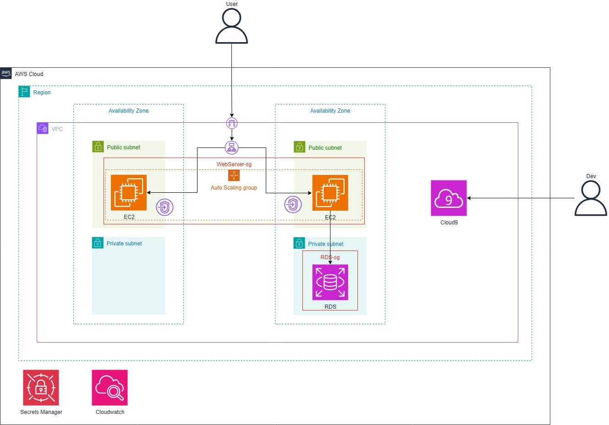
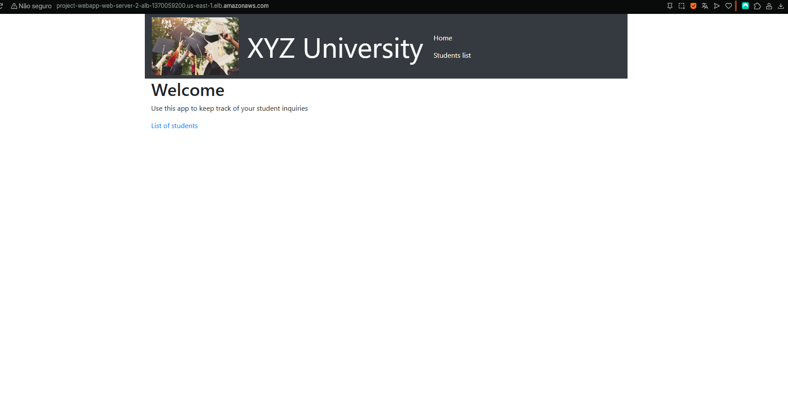
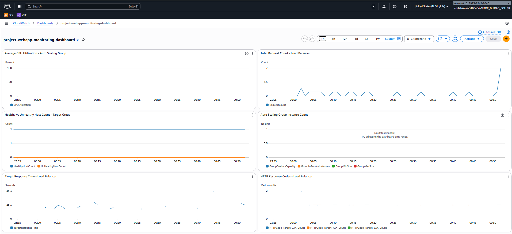
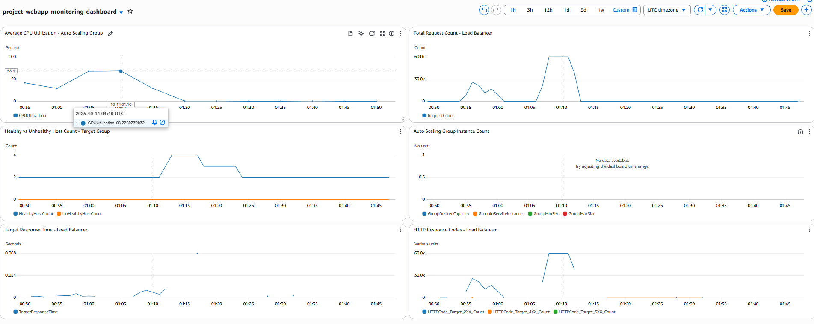

# Building a Highly Available, Scalable Web Application - AWS Capstone Project

ECM517 - Infraestrutura Cloud
Professor: Ricardo Tombi

Team members:

- Enzo Sakamoto - 21.00210-0
- João Branco - 21.01075-7
- Pedro Matumoto - 21.00784-5
- Rafael Rubio - 20.00611-0
- Vitor Soller - 21.01444-2

## Project overview

This repository contains Terraform configuration and scripts used to build a proof-of-concept (POC) for a highly available, scalable web application in AWS. The full project follows the multi-phase approach described in the lab instructions; this README focuses on references for Phase 4 (high availability & scalability) and the architecture diagram.

## Phase 4 — Implementation (references)

### Architecture diagram

## Screenshots / Evidence

Home page showing student records.

CloudWatch dashboard showing CPU, requests, and instance counts.

Auto Scaling event showing instances being added/removed. Notice that the instances scale out during high load and scale in when load decreases. The average of CPU usage needs to be above 60% to trigger a scale out event.

